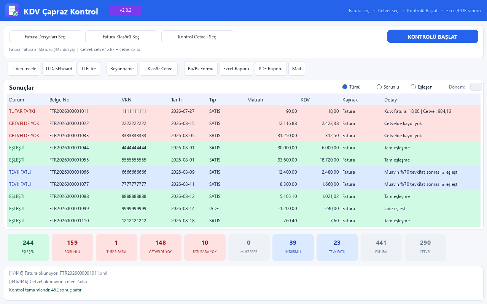

\# 📊 KDV Çapraz Kontrol Programı

Bu program e-Fatura, PDF ve Excel faturalarınızı KDV kontrol cetveli ile karşılaştırır. 

Farkları, eksikleri ve hataları otomatik bulur. Excel ve PDF rapor üretir.

\## 👨‍💻 Geliştirici

\*\*Arda M. Ekiz\*\*

\---

\## 🚀 Nasıl Kurulur? (Adım Adım)

\### Adım 1: Bilgisayarınızda Python Kurulu mu?

1\. Klavyeden \*\*Windows + R\*\* tuşlarına basın

2\. Açılan kutuya \*\*cmd\*\* yazın ve \*\*Enter\*\*'a basın

3\. Siyah ekrana şunu yazın: py -3.12 --version

\- ✅ \*\*"Python 3.12.x"\*\* yazıyorsa → Python kurulu, Adım 2'ye geçin

\-  \*\*"Python bulunamadı"\*\* yazıyorsa → \[Python 3.12'yi buradan indirin](https://www.python.org/downloads/release/python-31210/) ve kurun

&#x20; - Kurulumda \*\*"Add python.exe to PATH"\*\* kutusunu \*\*işaretlemeyi unutmayın!\*\*

\### Adım 2: Gerekli Programları Kurun

Cmd penceresinde şu komutu kopyalayıp yapıştırın ve \*\*Enter\*\*'a basın: py -3.12 -m pip install pymupdf openpyxl pytesseract pillow xlrd matplotlib fpdf2

Birkaç dakika bekleyin. "Successfully installed..." yazısı gelecek.

\### Adım 3: Programı Çalıştırın

\- Proje klasöründeki \*\*`calistir.bat`\*\* dosyasına \*\*çift tıklayın\*\*

\- Program açılacak 

> ⚠️ \*\*Not:\*\* İlk açılışta Windows Defender uyarı verebilir. "Daha fazla bilgi" → "Yine de çalıştır" deyin.

\---

\## 📖 Nasıl Kullanılır? (5 Adım)

\### 1️⃣ Faturalarınızı Seçin

\- \*\*"Fatura Klasörü Seç"\*\* butonuna tıklayın

\- Fatura dosyalarınızın olduğu klasörü seçin

\- (XML, PDF veya Excel olabilir)

\### 2️⃣ KDV Cetvelinizi Seçin

\- \*\*" Klasör Cetvel"\*\* butonuna tıklayın

\- KDV kontrol cetvelinizin klasörünü seçin

\- (Birden fazla dosya varsa hepsini seçer)

\### 3️⃣ Kontrolü Başlatın

\- \*\*"Kontrolü Başlat"\*\* butonuna tıklayın

\- Biraz bekleyin, sonuçlar tabloya gelecek

\### 4️⃣ Sonuçları İnceleyin

Tabloda göreceksiniz:

\- ✅ \*\*Yeşil\*\* = Eşleşen (sorun yok)

\- 🟡 \*\*Sarı\*\* = Dikkat (VKN farkı, mükerrer)

\- 🔴 \*\*Kırmızı\*\* = Sorunlu (tutar farkı, eksik)

\### 5️⃣ Rapor Alın

\- \*\*"Excel Raporunu Kaydet"\*\* → Excel raporu

\- \*\*"PDF Raporunu Kaydet"\*\* → PDF raporu

\- \*\*"📧 Mail Gönder"\*\* → Muhasebecinize mail atın

\---

\## 📸 Ekran Görüntüsü

\*(Buraya programın ekran görüntüsünü ekleyebilirsiniz)\*

\---

\## ❓ Sık Sorulan Sorular

\### Program açılmıyor, hata veriyor?

\*\*C:\*\* `py -3.12 -m pip install` komutunu tekrar çalıştırın.

\### "python bulunamadı" hatası alıyorum?

\*\*C:\*\* Python'u kurarken \*\*"Add to PATH"\*\* kutusunu işaretlemeyi unutmuşsunuz. Python'u kaldırıp tekrar kurun.

\### Mail gönder butonu çalışmıyor?

\*\*C:\*\* Gmail kullanıyorsanız \[Uygulama Şifresi](https://myaccount.google.com/apppasswords) oluşturmanız gerekir.

\### Türkçe karakterler bozuk görünüyor?

\*\*C:\*\* Bilgisayarınızın bölgesel ayarlarından "Türkiye" seçili olduğundan emin olun.

\### Excel/PDF rapor oluşmuyor?

\*\*C:\*\* Programı kapatıp yeniden açın, klasör yazma izniniz olduğundan emin olun.

\---

\## 💡 İpuçları

\-  \*\*Ayarlar hatırlanır\*\*: Son kullandığınız klasörler otomatik kaydedilir

\- 🔍 \*\*Gelişmiş Filtre\*\*: Tarih, VKN, tutar aralığı ile detaylı arama yapabilirsiniz

\- 📊 \*\*Dashboard\*\*: KPI kartları ve grafiklerle özet görün

\- 📅 \*\*Aylık Trend\*\*: Eski kontrollerinizle karşılaştırma yapabilirsiniz

\---

\## 📞 İletişim

Sorun mu yaşıyorsunuz? Bana ulaşın:

\- 🐙 \*\*GitHub\*\*: \[ArdaEkiz0](https://github.com/ArdaEkiz0)

\- 🔗 \*\*LinkedIn\*\*: \[arda-mehmet-ekiz](https://www.linkedin.com/in/arda-mehmet-ekiz-107640333/)

\- 📷 \*\*Instagram\*\*: \[@ardaaekiz](https://www.instagram.com/ardaaekiz/)

\- 📧 \*\*E-posta\*\*: ardaekiz72@gmail.com

\---

\## ⚖️ Lisans

Bu program MIT Lisansı ile korunmaktadır. Telif Hakkı © 2026 Arda M. Ekiz.

Detaylar için \[LICENSE](LICENSE) dosyasına bakın.

